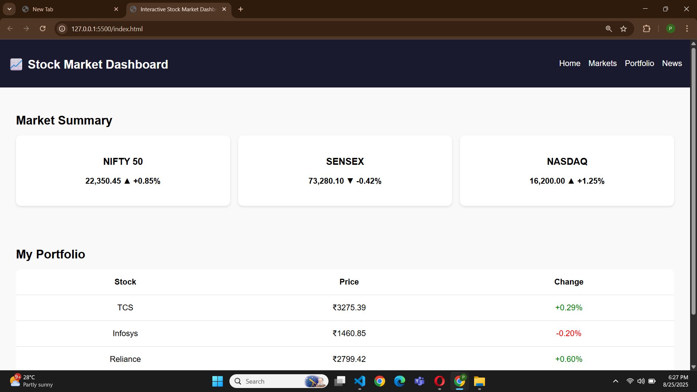

# 📈 Interactive Stock Market Dashboard

An interactive **Stock Market Dashboard** built with HTML, CSS.
This project simulates live stock price updates and provides a clean, responsive interface for tracking market indices and a personal portfolio.

---

## 🌟 Features
- 📊 Market summary cards for NIFTY 50, SENSEX, and NASDAQ
- 💹 Simulated real-time stock price updates
- 📑 Portfolio table with stock name, price, and % change
- 🎨 Responsive and clean design using CSS Grid & Flexbox                         
- ⚡ Highlight animation when stock prices update

---

## 🛠️ Technologies Used
- **HTML5** – structure  
- **CSS3** – styling (grid, flexbox, responsive UI)

---

## 📸 Screenshots

### 🏠 Dashboard Preview  

---

